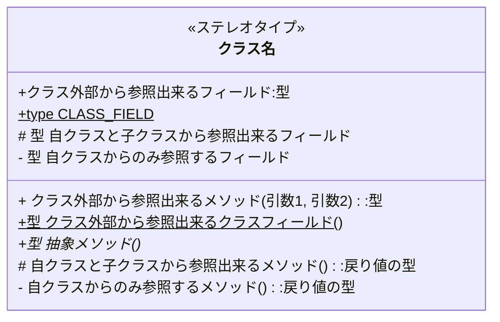

# UMLの簡単な説明

- 厳密にUMLの企画には合致してないかも知れません
- ↑のような状況なので実用に耐えうる最小限の記述に留めます

## クラス図

### 単一クラスの表現

```uml
class クラス名 <<ステレオタイプ>> {
  + クラス外部から参照出来るフィールド:型
  + {static} CLASS_FIELD:型
  # 自クラスと子クラスから参照出来るフィールド:型
  - 自クラスからのみ参照するフィールド:型
  + クラス外部から参照出来るメソッド(引数1, 引数2):型
  + {static}クラス外部から参照出来るクラスフィールド():型
  + {abstract}抽象メソッド():型
  # 自クラスと子クラスから参照出来るメソッド():型
  - 自クラスからのみ参照するメソッド():型
}
```



- クラスは上記の様な表記で記述されます
- 上から、クラス名、フィールド群、メソッド群を表します
- クラス名以外の枠は省略可能です。記述されている枠がフィールドを表しているのか、メソッドを表しているのかは記載されている物に```()```が付いてるかで判断できます。付いていればメソッドです。
- 省略するケースとしては以下の通りです。
  - フィールドは基本的に公開しないため、省略する事が多いです（プロパティ、定数、列挙型の場合は書きますが）
  - システム全体を表現するときは、クラス名だけを記載する事が多いです。それだとわかりにくい場合は、代表的な公開メソッドや、定数フィールドを記載します
- フィールド、メソッドのスコープは以下の物があります
  - ```+```はpublicを表します
  - ```#```はprotected(自クラスと子クラスからのみアクセス可能なフィールド)。省略する事が多いかな？
  - ```-```はprivateを表します。ほぼ記載しません。データモデルとしてのフィールドを表現するなら、プロパティとしてpublicとしても良いです。
  - ```~```はpackage privateを表します。ほぼ記載しません。
- フィールドは```[フィールドの型] [フィールド名]```もしくは```[フィールド名]:[フィールドの型]```と表現します。後者の方が可読性は高いのですが、mermaid的には、前者の記述の方が良いかもです。（理由は後述）
- フィールドの型は省略可能です。
 
